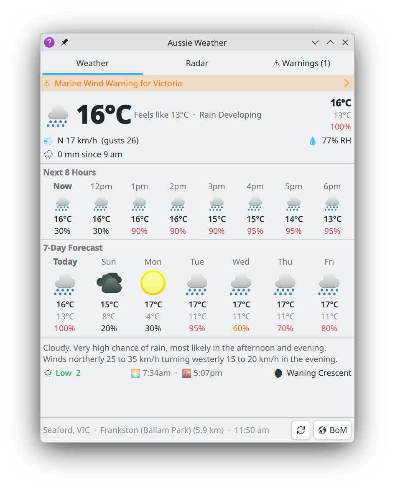
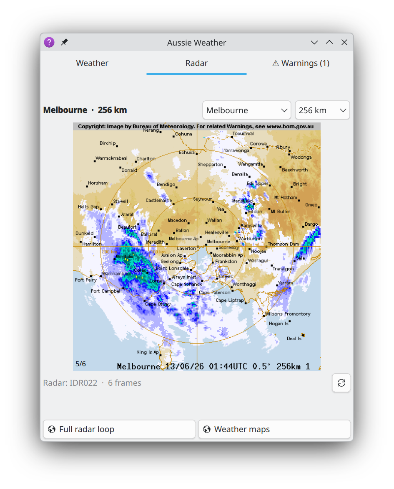
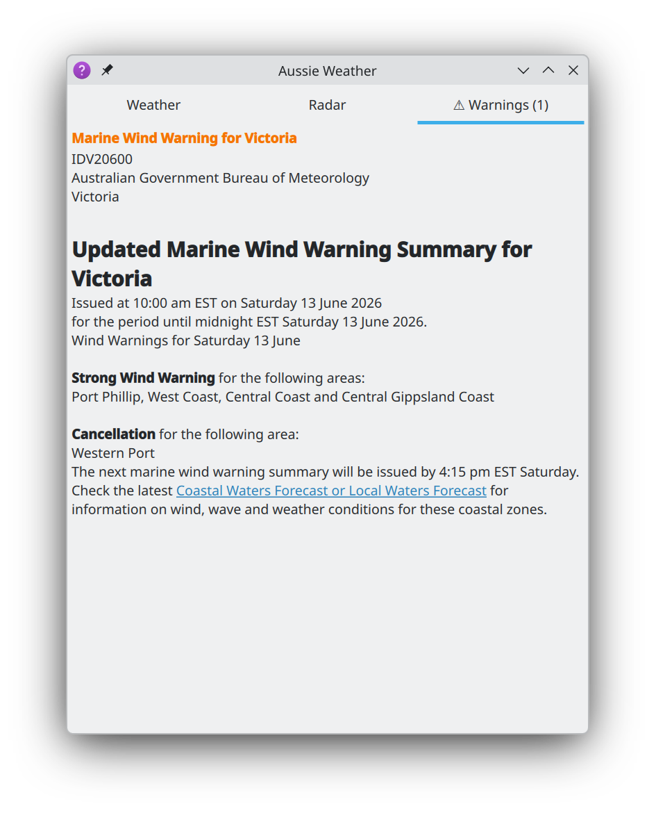
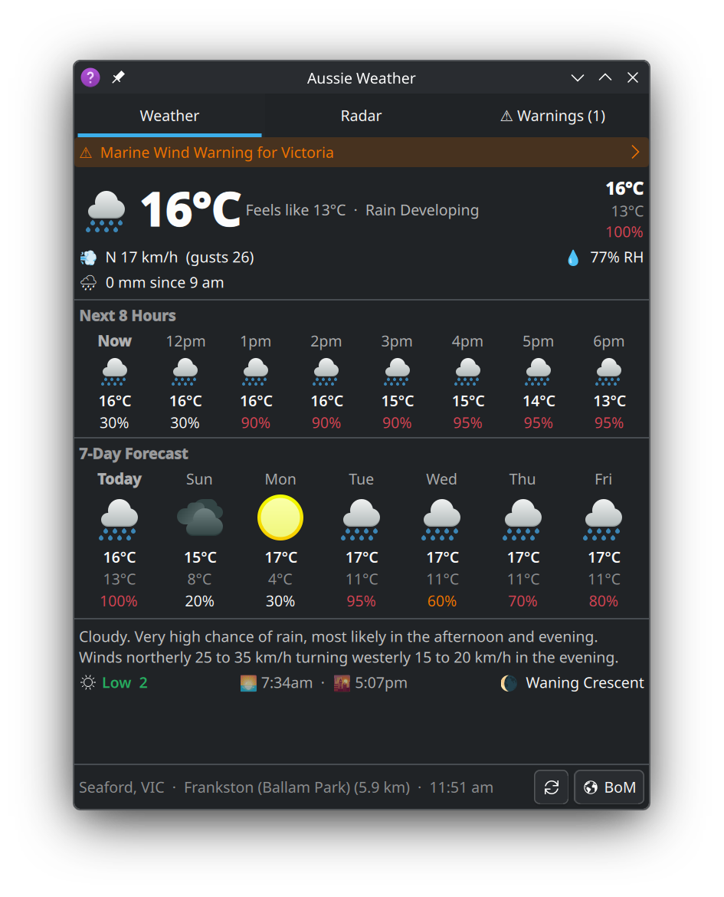
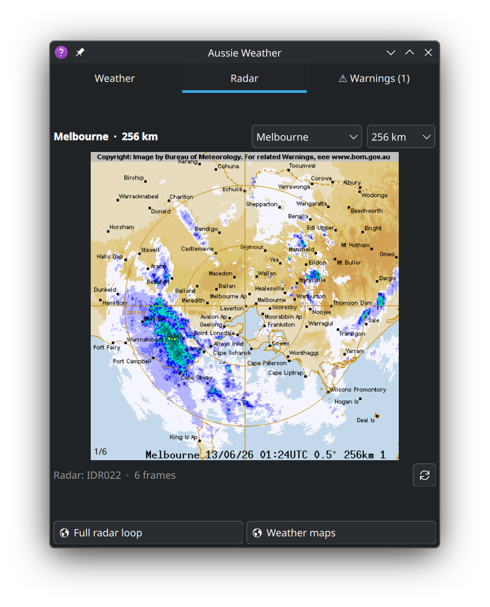
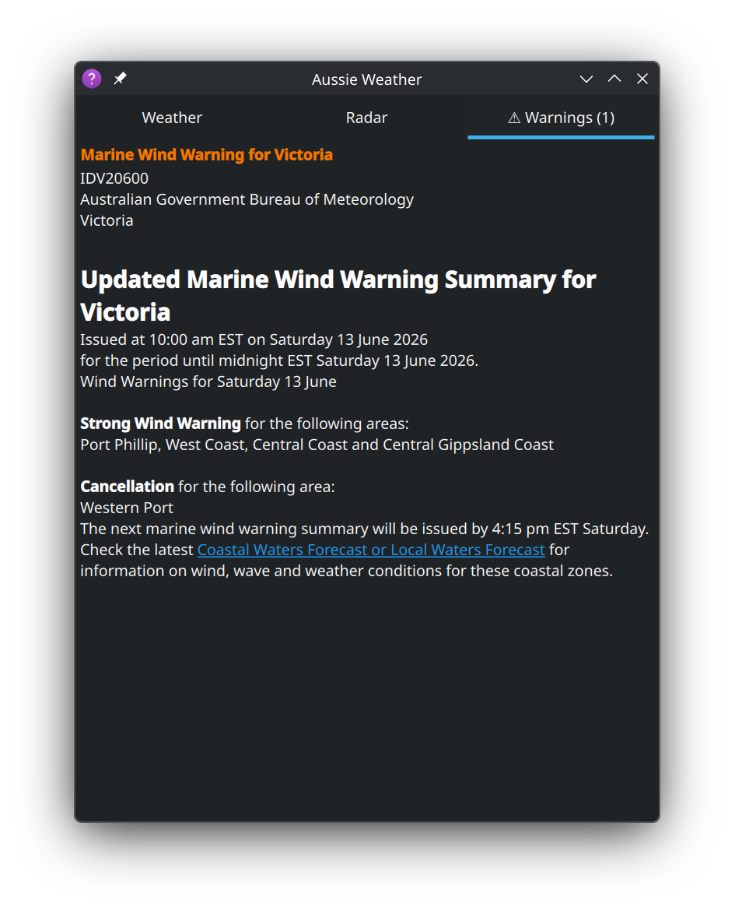

# Aussie Weather — Plasma 6 widget

Australian weather in your KDE panel: current conditions, hourly and 7-day
forecasts, UV, severe weather warnings, and an animated rain radar — data
from the Bureau of Meteorology's public API.

*Unofficial client; not affiliated with or endorsed by the Bureau of
Meteorology. Weather data © Australian Bureau of Meteorology.*

| Weather | Radar | Warnings |
| --- | --- | --- |
|  |  |  |
|  |  |  |

See the [README](https://github.com/hamsolodev/plasma-aussieweather#readme)
for features, installation, and configuration, and the
[CHANGELOG](https://github.com/hamsolodev/plasma-aussieweather/blob/main/CHANGELOG.md)
for release history.
